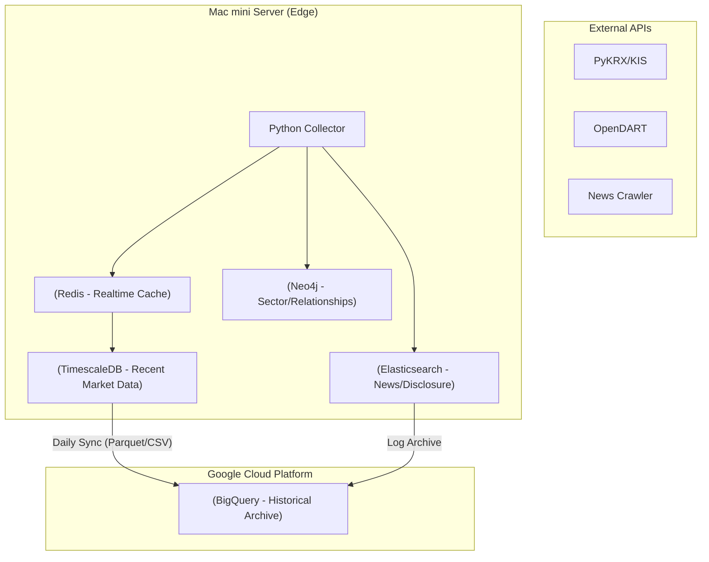

# Alpha-K v2.0: Institutional Grade Quant Architecture

## Overview

Alpha-K has evolved from a simple rule-based system into a hybrid AI-driven quant framework.
The next milestone (v2.0) focuses on building an **"Institutional Quality"** engine that can compete with Wall Street models by integrating **Data Memory**, **Sentiment Quantification**, **Portfolio Optimization**, and **Rigorous Backtesting**.

---

## 🏗️ 1. Data Architecture Layer (The Foundation)

**Goal:** Establish a high-performance, multi-layered data infrastructure on Mac mini (Apple Silicon) enabling "Intelligence-driven decisions".

### Architecture Overview

- **Edge Server:** Mac mini (Hot/Warm Data, Agent Execution)
- **Archive:** Google BigQuery (Cold Data, Long-term Analytics)

### Stack Selection & Roles

| Component          | Tech Stack                     | Role                                                              | Target Data                               |
| :----------------- | :----------------------------- | :---------------------------------------------------------------- | :---------------------------------------- |
| **Time-Series**    | **TimescaleDB** (PostgreSQL)   | High-speed storage for market ticks/candles. Agent SQL interface. | OHLCV, Tick Data, Smart Money Flow        |
| **Text/Search**    | **Elasticsearch** (ELK + Nori) | Full-text search & Sentiment Analysis engine.                     | News, DART Disclosures, Analyst Reports   |
| **Graph/Relation** | **Neo4j**                      | Relationship mapping for supply chain & theme propagation.        | Sector themes, Ownership, Supply Chain    |
| **Analytics**      | **Google BigQuery**            | Serverless warehouse for 10Y+ backtesting & ML.                   | Historical archive, Backtest logs         |
| **Cache/State**    | **Redis**                      | In-memory cache for real-time state & msg broker.                 | Real-time quotes, Agent State, API Limits |

### Data Flow (ETL)

### Action Items

1. **Infra Setup:** Docker Compose for TimescaleDB, ES (w/ Nori), Neo4j, Redis on Apple Silicon.
2. **Collector:** Async Python collector (Redis → Timescale/ES).
3. **Archive:** Daily BigQuery Load Job (Parquet).
4. **Integration:** Unified DAO pattern for agents to access all DBs.

---

## 🧠 2. Quantitative Sentiment Analysis (News Alpha)

**Goal:** Convert qualitative news into quantitative trading signals (-1.0 to +1.0).

### Why?

- Technicals lag; News leads.
- LLMs can now understand context better than simple NLP (Word2Vec).

### Implementation Plan

1. **News Crawler Integration**
   - Scrape Naver Finance / Dart specific to watchlist tickers.
2. **LLM Sentiment Scoring Agent**
   - **Input:** News headlines + summary.
   - **Output:**
     - `Sentiment Score`: -1.0 (Critical Bad) to +1.0 (Critical Good).
     - `Impact Duration`: Short-term vs. Structural.
   - **Model:** DeepSeek-R1 (Reasoner) for high-accuracy interpretation.
3. **Signal Integration**
   - If `Tech Score < 50` but `News Score > 0.8` (Strong Catalyst) → **Buy Signal (Event-Driven)**.

---

## ⚖️ 3. Portfolio Optimizer (Risk Parity)

**Goal:** Move from "Stock Selection" to "Portfolio Construction".

### Why?

- Picking 3 good stocks is risky if they are all correlated (e.g., mismatched beta).
- We need to minimize volatility while maximizing Sharpe Ratio.

### Implementation Plan

1. **Correlation Matrix Engine**
   - Calculate correlation coefficients between candidate assets.
   - Avoid picking top 3 stocks from the \*same\_ sector if correlation > 0.8.
2. **Position Sizing Algorithm**
   - **Volatility Targeting:** Allocation = (Target Risk / Asset Volatility).
   - **Kelly Criterion:** Optimal bet size based on win rate (from Backtest).

---

## 🧪 4. Backtesting Engine (The Truth Teller)

**Goal:** Validate strategies with historical data before risking real capital.

### Why?

- "It works in theory" != "It makes money".
- We need to simulate slippage, fees, and market impact.

### Implementation Plan

1. **Backtest Framework**
   - Integrate `Backtrader` or build a custom vector-based engine (`pandas`).
   - Replay historical data against `SectorAgent` and `TechnicalAgent` logic.
2. **Walk-Forward Analysis**
   - Optimize parameters (e.g., RSI period, VCP depth) on in-sample data (2018-2022).
   - Validate on out-of-sample data (2023-2024).

---

## 🗓️ Execution Roadmap

| Phase         | Task             | Description                                     | Est. Time |
| :------------ | :--------------- | :---------------------------------------------- | :-------- |
| **Phase 2.1** | **DB Layer**     | Setup TimescaleDB, ES, Neo4j, Redis.            | 1 Week    |
| **Phase 2.2** | **Sentiment**    | Build News Crawler + LLM Scoring Agent.         | 1 Week    |
| **Phase 2.3** | **Backtest**     | Build Backtesting Engine & Validate v1.0 Logic. | 2 Weeks   |
| **Phase 2.4** | **Optimization** | Implement Portfolio Correlation & Sizing Logic. | 1 Week    |
| **Phase 2.5** | **Dashboard**    | Visualization of Portfolio Risk & Performance.  | 1 Week    |

---

## 🎯 Final Deliverable

A fully autonomous **Hedge Fund in a Box** that:

1. Wakes up, reads the news, and checks the database.
2. Runs validated strategies to pick a diversified portfolio.
3. Executes trades with optimal sizing.
4. Generates a professional report explaining _why_.
