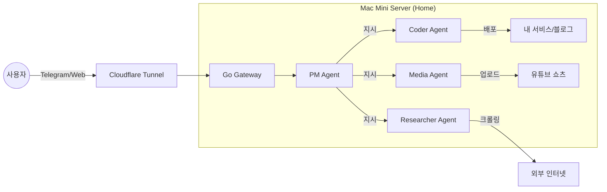

# 🐚 Woorung-Gaksi (우렁각시)

> **"While you live your life, I build your dreams."**

## 📖 About

**Woorung-Gaksi** is a local-first AI agent system designed to automate the boring parts of software engineering and content creation. Running efficiently on Apple Silicon (M4), it orchestrates multiple AI workers to plan, code, test, and deploy services autonomously.

## 1. 프로젝트 개요 (Executive Summary)

- **프로젝트명:** 우렁각시 (Woorung-Gaksi)
- **슬로건:** "퇴근하면 완성되어 있는 나만의 AI 소프트웨어 팩토리"
- **한줄 정의:** Mac Mini 기반의 **온프레미스 멀티 에이전트 오케스트레이션 플랫폼**
- **핵심 가치:**
  1. **생산성 극대화:** 기획, 개발, 리서치 등 반복 업무의 90% 자동화.
  2. **비용 최적화:** 클라우드(AWS) 대신 로컬 장비(Mac Mini) 활용으로 고정비 최소화 (월 $30 미만).
  3. **확장성:** 개인 비서로 시작하여 향후 API 판매(SaaS) 모델로 확장 가능.

---

## 2. 주요 기능 (Key Features)

시스템은 중앙의 **Brain(LangGraph)**을 중심으로 4가지 핵심 역할을 수행하는 에이전트로 구성됩니다.

| 역할 (Role)       | 에이전트명   | 주요 기능 및 시나리오                                                                                                                                                                          |
| ----------------- | ------------ | ---------------------------------------------------------------------------------------------------------------------------------------------------------------------------------------------- |
| **관리자 (PM)**   | **Manager**  | • 사용자의 자연어 요구사항(Telegram)을 분석하여 업무 분배 • 프로젝트 진행 상황 관리 및 결과 보고                                                                                            |
| **개발자 (Dev)**  | **OpenCode** | • **자동 코딩:** 웹 서비스(Next.js) 기획안을 바탕으로 코드 작성 • **로컬 배포:** Docker 컨테이너 실행 및 서버 구동 • **에러 수정:** 실행 실패 시 로그를 분석하여 자가 수정(Self-Healing) |
| **조사관 (Rsch)** | **OpenClaw** | • **데이터 수집:** 주식, 뉴스, 기술 트렌드 웹 크롤링 • **리포팅:** 복잡한 데이터를 요약하여 인사이트 제공                                                                                   |
| **PD (Media)**    | **Producer** | • **쇼츠 공장:** 대본 작성 → 음성 생성(TTS) → 영상 편집 → 유튜브 업로드 • 24시간 무중단 콘텐츠 생산 파이프라인                                                                              |

---

## 3. 시스템 아키텍처 (System Architecture)

"저비용 고효율"을 달성하기 위해 **Hybrid Architecture (Go + Python)**를 채택했습니다.

- **하드웨어:** Mac Mini M4 (24GB RAM) - _모든 데이터와 로직이 저장되는 본부_
- **인프라:** Docker Compose / OrbStack - _가볍고 빠른 컨테이너 관리_
- **AI 모델:** DeepSeek-V3 (API) - _가성비 최고의 외부 두뇌_
- **연결:** Cloudflare Tunnel - _보안 위협 없이 외부(모바일)에서 로컬 서버 접속_
- **백엔드:**
  - **Core/Gateway:** Go (Gin) - _극한의 리소스 효율과 동시성 처리_
  - **Agents:** Python (LangChain) - _풍부한 AI 생태계 활용_

---

## 4. 유저 시나리오 (User Journey)

**상황:** 사용자가 회사에서 점심시간에 아이디어가 떠오름.

1. **Input (12:30 PM):** 사용자가 텔레그램으로 _"요즘 핫한 AI 뉴스 3개 요약해서 블로그에 올리고, 관련 내용으로 쇼츠 영상 하나 만들어줘."_ 라고 전송.
2. **Process (12:31 PM ~ ):**
   - **PM:** 메시지 해석 후 '조사관'과 'PD'에게 업무 지시.
   - **조사관:** 테크 뉴스 사이트 크롤링 → 요약본 작성 → 블로그 DB에 저장(포스팅 완료).
   - **PD:** 요약본 바탕으로 대본 작성 → 관련 이미지 생성 → 영상 렌더링 시작.
3. **Output (18:00 PM):**
   - 퇴근길 사용자에게 알림 도착: _"✅ 블로그 포스팅 완료, 쇼츠 영상 업로드 대기 중입니다."_
   - 사용자는 집에 도착해서 결과물 확인 후 승인 버튼만 누름.

---

## 5. 단계별 로드맵 (Roadmap)

무리하게 한 번에 완성하지 않고, **MVP(최소 기능 제품)**부터 단계적으로 고도화합니다.

- **Phase 1: Foundation (현재 단계)**
  - 목표: "말 알아듣는 서버 만들기"
  - 범위: Mac Mini 세팅, Go Gateway + Telegram 연동, 기본 PM 에이전트(DeepSeek) 구현.

- **Phase 2: Automation (우렁각시 탄생)**
  - 목표: "일하는 에이전트 만들기"
  - 범위: OpenCode(개발) 및 OpenClaw(검색) 에이전트 연동. 블로그 자동 포스팅 구현.

- **Phase 3: Content Factory**
  - 목표: "멀티미디어 확장"
  - 범위: 영상 처리 파이프라인 구축, 유튜브 쇼츠 자동화.

- **Phase 4: SaaS Expansion (미래)**
  - 목표: "서비스 수익화"
  - 범위: API Gateway 구축, 사용자 과금 모델 도입, 외부 API 판매.

---

## 6. 리소스 및 비용 (Resources)

- **개발 인원:** 1명 (Full-stack Developer + AI Architect)
- **예상 소요 시간:** Phase 1~2까지 약 2주 (퇴근 후 개발 기준)
- **월 유지 비용:** **약 $15 ~ $20**
  - DeepSeek API: ~$10 (사용량 기반)
  - 전기세/인터넷: ~$5
  - 기타 도구: $0 (오픈소스 활용)

---

### 📝 PM을 위한 한 줄 요약

> **"우렁각시 프로젝트는 내 방구석 서버를 24시간 돌아가는 'IT 외주 업체'로 만드는 것입니다. 기획만 던지면 개발과 마케팅(쇼츠)은 AI 직원들이 알아서 처리합니다."**
